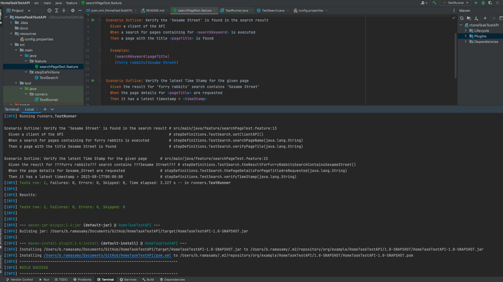

# HomeTaskTest API - WikiMedia Search


## Index
- [Introduction](#introduction)
- [Required Software](#required-software)
- [Getting the Code](#getting-the-code)
- [Project Structure](#project-structure)
- [Running the Tests](#running-the-tests)

# Introduction

This project is a comprehensive API testing for WikiMedia Api endpoints. In this project, I've automated the given two scenarios as per the home task
This project is built using Maven, Java, RestAssured, and Cucumber framework. It is designed to provide a scalable and maintainable structure for writing and executing API tests.

Scenario 1:

GIVEN A client of the API 

WHEN A search for pages containing for ‘furry rabbits’ is executed 

THEN A page with the title ‘Sesame Street’ is found

Scenario 2:

GIVEN The result for ‘furry rabbits’ search contains ‘Sesame Street’

WHEN The page details for Sesame Street are requested

THEN It has a latest timestamp > 2023-08-17


## Required Software
Below is a list of all software needed to be configured on your machine in order
to set up the test framework:
- [Java JDK 11](https://www.oracle.com/java/technologies/javase-jdk11-downloads.html) _(Or higher)_
- [Intellij IDEA](https://www.jetbrains.com/idea/download/#section=mac) _(Or any other Java IDE)_
- [Maven](https://mkyong.com/maven/install-maven-on-mac-osx/)


# Getting-the-code 
**Code can be cloned to your machine through the terminal, or directly from IntelliJ**

### Using the terminal
- Open your terminal, navigate to the desired directory where you want to
  have the project, and run the following command:
  **`git clone https://github.com/BoopalanRS/WikiMediaAPITest.git`**


- Open IntelliJ, Choose File -> Open, select your project directory, and click the "Open" button

### Using IntelliJ
- Open IntelliJ, Click "Get from VCS button", then type the repository's url,
  and choose your desired directory.


- **Once you clone the repository, and the IDE builds your maven project,
  you'll see the project in the following structure**

## Project Structure
```
|-.idea                                     #   git ignore config file
|-docs                                      #   all documentation related files and screenshots are here  
|-src    
   |-main   
     |-java                     
           |-[+]feature                     #   this package includes all the feature files of cucumber framework               
                |-searchPageTest.feature    #   this is cucumber feature file, where test scenarios are wrtting in gerkin formate
           |-[+]stepDefinition              #   this package includes testDefinition classes            
                |-TestSearch                #   java class, where test funtions are written as per the scenarios in the feature file
   |-test
     |-java                 
        |-runner                            #   this package contains cucumber test runner configuration file for the test structures and groupings
            |-TestRunner                    #   this is the testRunner java file from where cucumer configuration is available
     |-resources                            #   resources folder, json files, xml files, excel files
        |-config.properities                #   this package that will contain all global configs and properties
|-.gitignore                                #   git ignore config file
|-pom.xml                                   #   maven's project object model file which contains all project's required dependencies, plugins, profiles, etc
|-README.md                                 #   you are currently viewing this file
```   
## screenshot : project folder structure


## Running the Tests

### How to run the tests
Tests can be run using a maven command in the terminal/commandline from the project located folder,
Example : |locationOfTheRepositoryDownloaded| HomeTaskTestAPI % "we need to pass the below command here"

```
mvn clean install
```
or
```
mvn clean test
```
## Screen shot to run the maven (mnv) command to RUN the test


## Screenshot of test case execution result 


For future, we can also add reports like Allure or any other.
